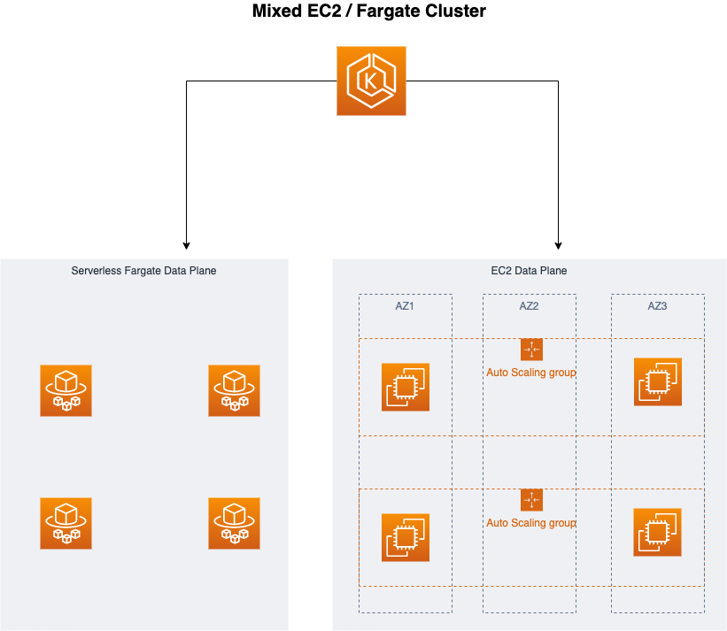
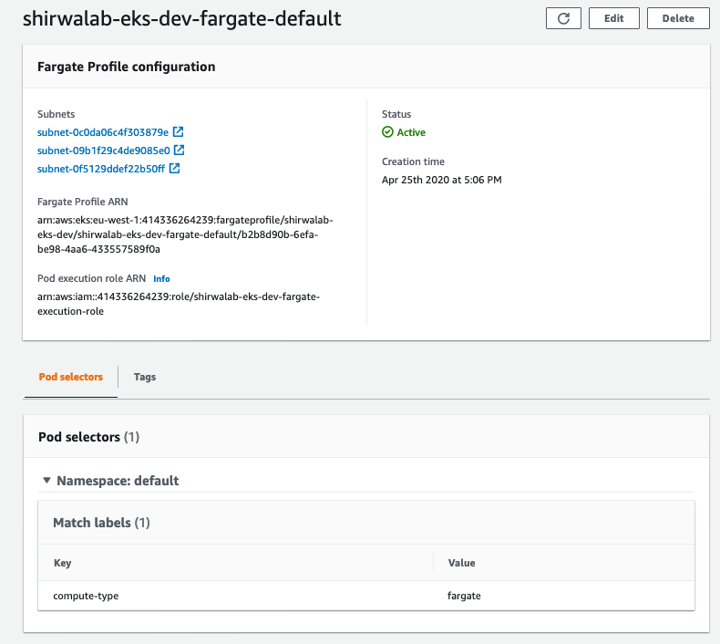

# EKS Fargate

AWS Fargate is a technology that provides on-demand, right-sized compute capacity for containers. With AWS Fargate, you no longer have to provision, configure, or scale groups of virtual machines to run containers. This removes the need to choose server types, decide when to scale your node groups, or optimize cluster packing.

AWS Fargate with Amazon EKS is currently only available in the following Regions:

| Region Name | Region |
|---|---|
| US East (N. Virginia) | us-east-1 |
| US East (Ohio) | us-east-2 |
| EU (Ireland) | eu-west-1 |
| EU (Frankfurt) | eu-central-1 |
| Asia Pacific (Singapore) | ap-southeast-1 |
| Asia Pacific (Sydney) | ap-southeast-2 |
| Asia Pacific (Tokyo) | ap-northeast-1 |

There are currently a few limitations that you should be aware of:

* There is a maximum of 4 vCPU and 30Gb memory per pod.
* Currently there is no support for stateful workloads that require persistent volumes or file systems. Support for EFS is coming soon - https://github.com/aws/containers-roadmap/issues/826
* You cannot run Daemonsets, Privileged pods, or pods that use HostNetwork or HostPort.
* The only load balancer you can use is an Application Load Balancer.


## Setup ECS Cluster



### Installing the Client Tools

**Download terraform**

```
wget https://releases.hashicorp.com/terraform/0.12.23/terraform_0.12.23_darwin_amd64.zip
unzip terraform_0.12.23_darwin_amd64.zip
sudo mv terraform /usr/local/bin/terraform
```

**Download aws-iam-authenticator**

```
curl -o aws-iam-authenticator https://amazon-eks.s3-us-west-2.amazonaws.com/1.14.6/2019-08-22/bin/darwin/amd64/aws-iam-authenticator
chmod +x aws-iam-authenticator
sudo mv ./aws-iam-authenticator /usr/local/bin/aws-iam-authenticator
```

### Provision EKS Cluster

Clone github repo

```
git clone https://github.com/shirwahersi/eks-fargate-lab.git
cd eks-fargate-lab/terraform
```

```
terraform init
terraform plan
terraform apply
```

Create kubeconfig file:

```
terraform output kubectl_config > ${HOME}/.kube/crafter-eks
export KUBECONFIG=${HOME}/.kube/crafter-eks
```

Verify Cluster

```
kubectl get nodes -o wide
NAME                                         STATUS   ROLES    AGE     VERSION               INTERNAL-IP    EXTERNAL-IP   OS-IMAGE         KERNEL-VERSION           
       CONTAINER-RUNTIME
ip-172-16-1-224.eu-west-1.compute.internal   Ready    <none>   4h30m   v1.15.10-eks-bac369   172.16.1.224   <none>        Amazon Linux 2   4.14.165-133.209.amzn2.x8
6_64   docker://18.9.9
```

## AWS Fargate profile

Before you can schedule pods on Fargate in your cluster, you must define at least one Fargate profile that specifies which pods should use Fargate when they are launched.

The Fargate profile allows an administrator to declare which pods run on Fargate. This declaration is done through the profile’s selectors. Each profile can have up to five selectors that contain a namespace and optional labels. You must define a namespace for every selector. The label field consists of multiple optional key-value pairs. Pods that match a selector (by matching a namespace for the selector and all of the labels specified in the selector) are scheduled on Fargate. If a namespace selector is defined without any labels, Amazon EKS will attempt to schedule all pods that run in that namespace onto Fargate using the profile. If a to-be-scheduled pod matches any of the selectors in the Fargate profile, then that pod is scheduled on Fargate.

**Fargate profile components:**

* **Pod execution role** - When your cluster creates pods on AWS Fargate, the pod needs to make calls to AWS APIs on your behalf, for example, to pull container images from Amazon ECR. The Amazon EKS pod execution role provides the IAM permissions to do this.
* **Subnets** - The IDs of subnets to launch pods into that use this profile. At this time, pods running on Fargate are not assigned public IP addresses, so only private subnets (with no direct route to an Internet Gateway) are accepted for this parameter.
* **Selectors** - The selectors to match for pods to use this Fargate profile. Each selector must have an associated namespace. Optionally, you can also specify labels for a namespace. You may specify up to five selectors in a Fargate profile. A pod only needs to match one selector to run using the Fargate profile.
    * **Namespace** - You must specify a namespace for a selector. The selector only matches pods that are created in this namespace, but you can create multiple selectors to target multiple namespaces.
    * **Labels** - You can optionally specify Kubernetes labels to match for the selector. The selector only matches pods that have all of the labels that are specified in the selector.

Creating Fargate profile using terraform:

```
resource "aws_eks_fargate_profile" "fargate_profile_default" {
  cluster_name                  = local.cluster_name
  fargate_profile_name          = format("%s-fargate-default", local.cluster_name)
  pod_execution_role_arn        = module.FargateExecutionRole.this_iam_role_arn
  subnet_ids                    = module.vpc.private_subnets

  selector {
    namespace                   = "default"
    labels                      = { compute-type = "fargate" }
  }
  depends_on = [ module.eks ]
}
```

Following is fargate profile created in EKS dashboard:



## Deploying Pods to Fargate

```
kubectl run nginx-fargate --image=nginx --restart=Never --labels=compute-type=fargate
pod/nginx-fargate created
```

> Output

```
kubectl get pods -o wide
NAME            READY   STATUS    RESTARTS   AGE   IP             NODE                   NOMINATED NODE   READINESS GATES
nginx-fargate   1/1     Running   0          54s   172.16.1.241   fargate-172.16.1.241   <none>           <none>
```

# Useful Resources

* [AWS re:Invent 2019: Running Kubernetes Applications on AWS Fargate](https://www.youtube.com/watch?v=m-3tMXmWWQw)
* [eksworkshop.com](https://eksworkshop.com/)
* [EKS Docs](https://docs.aws.amazon.com/eks/latest/userguide/what-is-eks.html)
* https://bcouetil.gitlab.io/academy/BP-kubernetes.html#full-project-example
* https://itnext.io/eks-fargate-extensibility-of-kubernetes-serverless-benefits-77599ac1763


